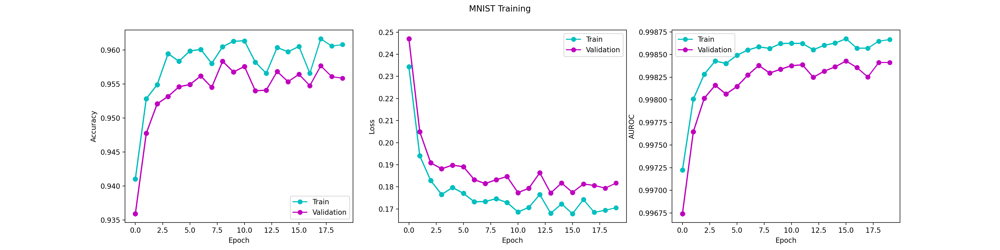
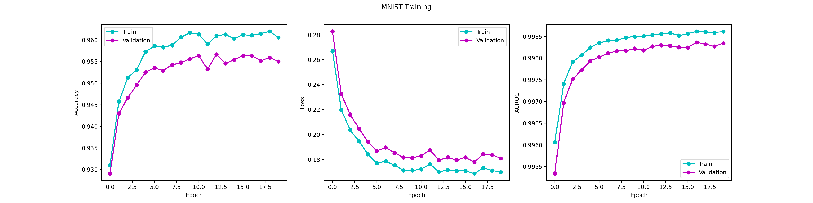
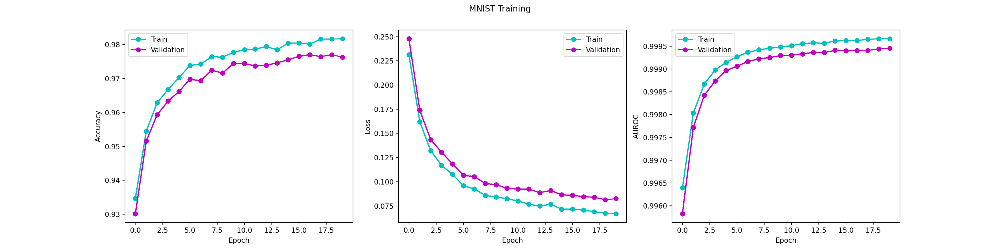
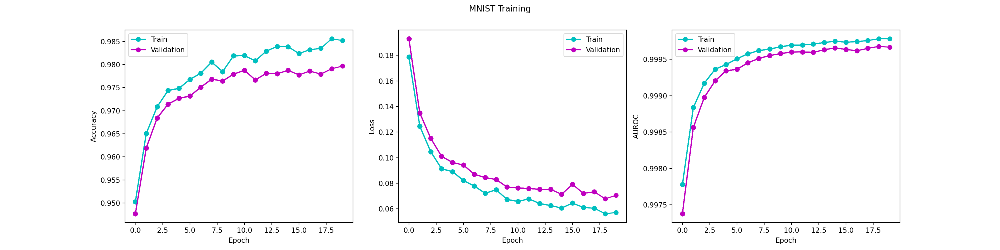
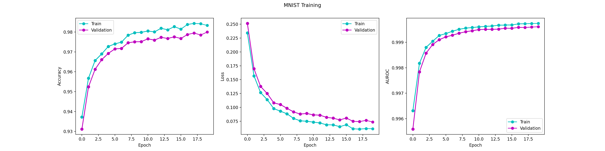
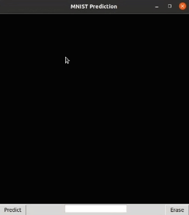

# MNIST-Project
Since the classification is quite simple, I decided to start off with 1 convolution layer. As you can see, I experimented with model parameters and filter parameters until I reached my final model. The dataset is well balanced, so I can trust accuracy as a metric. But out of curiosity, I included the ROC AUC and F1 score to see how it treats the misclassified data.
These initial values were mostly arbitrary. I chose a large filter since there's only 1 convolutional layer, but I experiment with changing it to see the effects.
### Trial 1
1 Conv Layer - Output: 16, K: 7, S: 3, P: 1
1 FC Layer
Batch size: 32
Learning Rate: 0.001
Weight Decay: 0.01

    Lowest Epoch: 15
    Training
    Accuracy: 0.9605
    Loss: 0.1678
    AUROC: 0.9987
    F1 Score: 0.9605

    Validation
    Accuracy: 0.9564
    Loss: 0.1775
    AUROC: 0.9984
    F1 Score: 0.9564

    Testing
    Accuracy: 0.9627
    Loss: 0.1588
    AUROC: 0.9989
    F1 Score: 0.9627

### Trial 2 - modifying learning rate
1 Conv Layer - Output: 16, K: 7, S: 3, P: 1
1 FC Layer
Batch size: 32
Learning Rate: 0.0005
Weight Decay: 0.01

    Lowest Epoch: 16
    Training
    Accuracy: 0.9611
    Loss: 0.1687
    AUROC: 0.9986
    F1 Score: 0.9611

    Validation
    Accuracy: 0.9563
    Loss: 0.1779
    AUROC: 0.9984
    F1 Score: 0.9563

    Testing
    Accuracy: 0.9630
    Loss: 0.1602
    AUROC: 0.9988
    F1 Score: 0.9630

### Trial 3 - modifying weight decay
1 Conv Layer - Output: 16, K: 7, S: 3, P: 1
1 FC Layer
Batch size: 32
Learning Rate: 0.0005
Weight Decay: 0.001

    Lowest Epoch: 18
    Training
    Accuracy: 0.9816
    Loss: 0.0674
    AUROC: 0.9997
    F1 Score: 0.9816

    Validation
    Accuracy: 0.9770
    Loss: 0.0813
    AUROC: 0.9994
    F1 Score: 0.9770

    Testing
    Accuracy: 0.9783
    Loss: 0.0721
    AUROC: 0.9996
    F1 Score: 0.9783

### Trial 4 - modifying number of filters
1 Conv Layer - Output: 32, K: 7, S: 3, P: 1
1 FC Layer
Batch size: 32
Learning Rate: 0.0005
Weight Decay: 0.001

    Lowest Epoch: 18
    Training
    Accuracy: 0.9844
    Loss: 0.0573
    AUROC: 0.9998
    F1 Score: 0.9844

    Validation
    Accuracy: 0.9792
    Loss: 0.0706
    AUROC: 0.9996
    F1 Score: 0.9792

    Testing
    Accuracy: 0.9825
    Loss: 0.0595
    AUROC: 0.9998
    F1 Score: 0.9825

I was worried increasing more learnable parameters would lead to overfitting, but the plot shows it's not overfitting and actually increases the accuracy.
### Trial 5 - modifying batch size
1 Conv Layer - Output: 32, K: 7, S: 3, P: 1
1 FC Layer
Batch size: 64
Learning Rate: 0.0005
Weight Decay: 0.001

    Lowest Epoch: 18
    Training
    Accuracy: 0.9834
    Loss: 0.0619
    AUROC: 0.9997
    F1 Score: 0.9834

    Validation
    Accuracy: 0.9788
    Loss: 0.0741
    AUROC: 0.9996
    F1 Score: 0.9788

    Testing
    Accuracy: 0.9802
    Loss: 0.0649
    AUROC: 0.9997
    F1 Score: 0.9802

Increasing the batch size was slower and didn't really help, however it dampened the loss in the plot.
### Trial 6 - decreasing filter size
1 Conv Layer - Output: 32, K: 5, S: 2, P: 1
1 FC Layer
Batch size: 32
Learning Rate: 0.0005
Weight Decay: 0.001

    Lowest Epoch: 18
    Training
    Accuracy: 0.9844
    Loss: 0.0573
    AUROC: 0.9998
    F1 Score: 0.9844

    Validation
    Accuracy: 0.9792
    Loss: 0.0706
    AUROC: 0.9996
    F1 Score: 0.9792

    Testing
    Accuracy: 0.9825
    Loss: 0.0595
    AUROC: 0.9998
    F1 Score: 0.9825

I'm quite happy with this. I don't think I need to experiment with more layers because it will only add more parameters making it longer to run and could overfit.

I decided to make a quick interface to see the model in action. I used tkinter to make a GUI where you can draw a number and have the model predict. It does fairly well with the numbers and it's cool to see it in action. It has a hard time predicting number 9.

